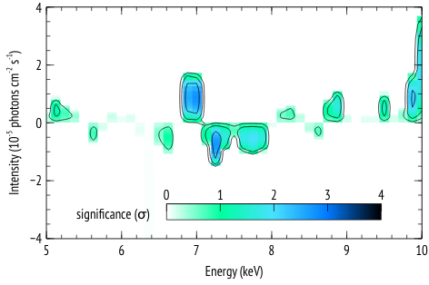
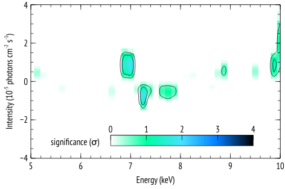

### Description
This repository contains a collection of scripts written in `tcl` to be used within `xspec`, [the X-ray spectral modeling package](https://heasarc.gsfc.nasa.gov/xanadu/xspec/). It contains several useful functions that streamlines some of the `xspec` functionality. Examples of the functions include:

- `az_scan_en_norm` and `az_sim_dchi2`: which can be used for scanning fit residuals for spectral emission or absorption lines and assessing their significance. 
- `az_calc_errors`: Calculate the uncertainties on the fit parameters, making sure to restart if a new fit is found, save progress, and save the final results in clean manner.
- `az_rand_pars`: randomize the parameters given the covariance from the best fit, or give a loaded MCMC chain.
- `az_rand_plot`: Plot a set of models whose parameters are randomly-selected from the best fit parameters and their covariance.
- `az_save_pars`: return a string (`$res`) that has the current parameters, so that they can be loaded again quickly by doing `newpar $res`. 
- `az_best_chain_pars`: return a string (`$res`) of the best parameters from a loaded chain. These parameters can be applied to the model by doing: `newpar $res`.
- `az_plot_unfold`: a clean and easy function to plot the unfoled data, model and their residual and ratio to a [veusz](https://veusz.github.io/)-ready file.
- `az_free_params`: returns a list of free parameters.


### Usage Example
The following is an example of how the functions `az_scan_en_norm` and `az_sim_dchi2` can be used, along with the script `az_proc_scan.py` to generate plots of residual significance given some best fit model to the data, similar to those in Figure 2 of [this article](https://arxiv.org/abs/1501.01663). 

The steps as presented in that paper are:

1- Start with a baseline model with its best fit `chi-squared` and covariance matrix (or MCMC chain) that encodes the uncertainty of best value parameters.

2- Draw `N` random sets of parameters using the covariance matrix (or MCMC chain if loaded). 

3- For each parameter set, simulate a spectrum using the observed detector response and background files. This produces `N` simulated spectra that are drawn from the baseline model, taking into account its uncertainty.

4-  Add a narrow Gaussian line and scan in energy and normalization and record the maximum improvement in
`delta-chi-squared`. This gives `N` values of `delta-chi-square` that are used to construct a reference distribution to which observed `delta-chi-squared` values are compared. The significance of an observed
`delta-chi-squared` is then inferred from the number of simulated fit improvement cases that have a `delta-chi-squared` that is as extreme as observed.

#### Steps

Assuming we have a file `fit.xcm` that loads both the data and the model, then, in `xspec`:

```tcl
XSPEC12>source azTcl/az.tcl
XSPEC12>az_scan_en_norm fit.xcm 5 {10 5 10 40} {log 13 1e-6 1e-4 30} 1 0
XSPEC12>az_sim_dchi2 100 fit.xcm 5
```
Where, the first line loads the script.

The next line scans the residuals by stepping though energy (parameter number 10 from 5 to 10 keV with 40 steps) and intensity (parameter number 13 from 1e-6 to 1e-4 with 30 steps). The `log` before 13 indicates that the steps are in log-space. 
The scanning is done by adding a narrow gaussian line (component 5 in the model in this case) and stepping through the its energy and intensity values and recording the improvement in fit statistic.

Then `mode=1`, so that we do both positive and negative intensity values, so that both emission and absorption lines are considered. In this example, the total number of intensity values is 30 x 2 = 60.

The last number is the redshift, so the energies are in the rest-frame of the source. Here, we used 0 for illustration.

> This writes a file called `fit.scan` that has the results of the scanning in energy and intensity

One can stop at this point and use a simple f-test to assess the significant of the residual features by calling `az_proc_scan.py` and giving `fit.scan` as input. This is however is not strictly correct (see discussion in the [paper](https://arxiv.org/abs/1501.01663) and reference therein). The reference `chi-squared` distribution need to be extracted from Monte-Carlo simulation that searches for features in the residuals that expected from pure noise fluctuations in the baseline model.

These simulation can be run using the command `az_sim_dchi2 100 fit.xcm 5`, where `100` is the number of simulated spectra (typically, one needs a larger number), `fit.xcm` is the file that loads the data and model, and 5 is the component number where the search gaussian is to be added.

The results will be saved: `fit.sim`

When running `az_proc_scan.py`, the code will search for a `.sim` file in the same location as in `.scan` file, and process it if found (otherwise use only the `.scan` file produced by `az_scan_en_norm`).

The result of running `az_proc_scan.py` is a file named `fit.2d.plot` that can be read by [veusz](https://veusz.github.io/) for plotting. An example veusz file (.vsz) is given along with this example.

The scales and units in the plot may depend on the specific case, so the plots are given in `veusz` format to give the user the freedom in the plot settings.






